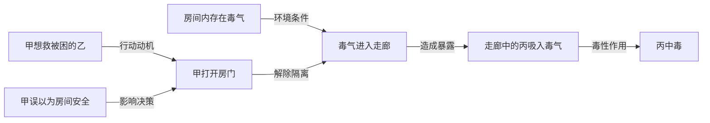

很好 但我认为你写的不符合我的文笔 可以阅读早期我和claude合作写的文笔：找到了，小说名是 **《归乡疫期》**，对应 Claude 会话：

- **会话标题：**《末日前夜的倒计时》
- \*\*时间：\*\*2026 年 4 月 1—2 日
- **[打开本地会话全文 (line 25)](/Users/gengrf/claude-chats-md/conversations/083-末日前夜的倒计时-284f486f.md:25)**
- [**打开 Claude 原会话**](https://claude.ai/chat/284f486f-8259-4c4d-8525-9af4b36c7f63)

已核对原文：你贴了春运返乡、疫情与丧尸末日预警的小说草稿，要求扩写到三万字左右；后续还有**南京租别墅做安全屋、Costco 和山姆采购**的情节。

开头是：

> 我总觉得自己陷在一场醒不来的梦里。有个声音钉在我的太阳穴里……


此外可以根据这个框架来提炼分析和续写  ：\*\*可以。上帝视角的基本对象应该是“整个世界的状态＋改变世界的事件”；因果视角则解释这些事件为什么发生、怎样产生后果。\*\*人物对象是这个世界的一部分。

先校正一点：\*\*按章节保存状态，并不天然等于主角视角。\*\*章节是叙述位置；主角视角取决于“主角能观察到什么、知道什么、相信什么”。

可以把同一套小说数据分成四种视图：

| 视图要回答的问题 |                         |
| -------- | ----------------------- |
| **全局状态** | 此刻每个人在哪里、持有什么、世界处于什么状态？ |
| **因果关系** | 什么条件和行动共同造成了这个结果？       |
| **角色认知** | 各角色知道、误解、怀疑或隐瞒了什么？      |
| **叙事披露** | 读者在哪一章得知了哪些事实？          |

它们共用事件记录，不必分别维护四套互相矛盾的剧情。

**第一层：把整个小说世界建成一个状态对象。**
```makefile
WorldState:
    characters       # 所有角色的状态
    locations        # 地点、环境、通行条件
    objects          # 物品归属、位置、是否损坏
    organizations    # 势力、成员、资源、制度
    rules            # 功法限制、世界运行规则
    active_processes # 中毒、追捕、仪式、倒计时等持续过程
```

这里需要保留“持续过程”。例如，中毒可能在几章前开始，之后逐渐发作；不能只有“服毒”和“死亡”两个瞬间。

**第二层：让事件负责改变世界。**

人物属性的变化不应凭空出现，而应能追溯到事件：
```bash
Event:
    id
    story_time       # 故事中何时发生
    revealed_at      # 原文何时披露
    participants     # 谁参与
    preconditions    # 哪些条件使它能够发生
    intention        # 行动者想达到什么
    action           # 实际做了什么
    effects          # 实际改变了哪些状态
    evidence         # 原文出处
    certainty        # 明确事实、推断、争议或未知
```

于是，原来的“角色技能变化链表”就变成：
```
获得秘籍事件 → 学会某种方法
练习事件     → 掌握程度变化
受伤事件     → 某能力暂时无法使用
治疗事件     → 能力部分恢复
```

角色卡可以从这些事件中计算出来，事件同时解释了属性为什么变化。

**第三层：因果图要区分条件、动机、机制与结果。**

用一个虚构例子说明，并非《妖女看招》的实际剧情：
````less

````

这张图同时容纳了：

- **意图**：甲想救人。
- **实际后果**：丙受到伤害。
- **错误认知**：甲不知道房间有毒气。
- **因果机制**：开门改变隔离条件，毒气扩散并造成暴露。

“有毒气”和“开门”共同促成结果。因此，复杂因果最好支持**多个条件共同满足**，不能把所有边都解释成“单独足以导致”。

**第四层：上帝视角也要保存未知，不能自动编造真相。**

可以分别记录：
```
世界事实：药瓶被替换。
甲的认知：药瓶没有变化。
乙的认知：知道是谁替换的。
读者状态：第90章尚不知情，第100章才获悉。
尚未确认：替换者是否受第三人指使。
```

这样才能处理悬疑、误会、背叛、隐瞒和不可靠叙述。对于已有小说，我们只能建立“原文已经确立的全局事实”，不能因为叫上帝视角，就把未揭晓内容补成事实。

还应另存**作者的创作意图**：“为了推动人物成长，让丙受伤”属于写作设计；故事内部仍然需要毒气、开门、暴露这样的具体过程。

对我们现有 LightRAG，最合适的升级方向是：

**原文证据 → 事件记录 → 全局状态变化 → 因果关联 → 角色与读者的不同视图。**

现有实体关系图负责找到相关资料；新增事件层负责组织变化和解释后果。以后就能查询：

- 某章结束时，世界真实状态是什么？
- 甲的计划为什么失败，在哪个环节出了问题？
- 哪个角色的错误认知推动了冲突？
- 某个后果有哪些尚未兑现的影响？
- 删除某个事件，会破坏后续哪些剧情依据？

最后一种查询可以检查剧情依赖；若要进一步推演“删掉事件后世界究竟怎样发展”，还需要明确的行为与世界规则。**只有一张因果图，仍不足以保证反事实推演正确。**


\*\*目前抽出了人物、关系、功法、地点、组织、事件等“素材和综合描述”，但还没有整理成可靠的角色卡、成长时间线和世界观卡。\*\*我刚检查了实际存储，区别如下：

| 你关心的信息目前已有还缺什么 |                            |                           |
| -------------- | -------------------------- | ------------------------- |
| **人物关系**       | 人物之间的关联、关系描述、关键词、原文来源      | 按阶段区分关系；明确方向、真假、变化原因      |
| **角色卡**        | 姓名、别名、身份、外貌、经历、动机等混合在人物描述里 | 固定字段、事实核验，以及“截至某章”的角色状态   |
| **性格变化**       | 描述中可能包含早期性格、后续行为和情绪线索      | 区分稳定性格、临时情绪、伪装；证明变化发生在哪一段 |
| **技能变化**       | 功法、招式、体质、法器，以及人物与它们的关联     | 获得、掌握、受限、失去、恢复的过程及代价      |
| **世界观卡**       | 地点、门派、组织、修炼概念、功法、历史事件      | 整理成明确规则，并区分事实、传闻和角色猜测     |
| **事件与伏笔**      | 部分事件实体、相关人物与原文             | 完整事件顺序、因果链、伏笔提出与兑现状态      |

例如，实际图谱中：

- **苏真、童双露、邵晓晓**都有较长的综合人物描述。
- **苏真—邵晓晓**的关系描述已经混合了不同阶段的相处和关系发展。
- **性灵经、种鬼秘术、罗刹花术**被归为功法／方法，**太巫身**被归为概念。
- **九妙宫、西景国**分别保存了组织与地域的综合描述。

这些是**模型抽取结果，尚不能直接当成已核实设定**。尤其综合描述会把不同章节揉在一起，容易出现“后期事实覆盖前期状态”的问题。

\*\*目前的“逐章分析页”也有明确边界：\*\*它保存的是该章的原文切片、抽取实体名、关系对和缓存 ID，并没有另做性格分析、技能成长分析或文学分析。图谱里的 `created_at` 是记录创建时间，不能当作故事中的时间。

要服务续写，最值得补的是一层**带章节依据的角色状态记录**，例如：
```
角色：某人物
有效位置：截至第 N 章

当前目标：
已知信息：
人物关系及当前阶段：
已掌握能力、使用条件与代价：
身体状态与持有物：
尚未兑现的承诺：

本阶段变化：
  变化前 → 触发事件 → 变化后
  原文依据：章节 + 片段 ID
  判断性质：明确事实 / 角色自述 / 推断 / 存在冲突
```

其中，**“使用过某技能”不等于“永久掌握”，“一次退让”不等于“性格变软”，“同场出现”不等于“建立同盟”**。这一层需要回读原文判断，不能只重新排列图谱摘要。

另外，已发现的末章疑似污染会影响这些判断。建议先核验主角和当前剧情涉及的原文，再生成少数主要角色的状态卡与世界规则卡，避免把污染内容整理得更加像“权威设定”。

