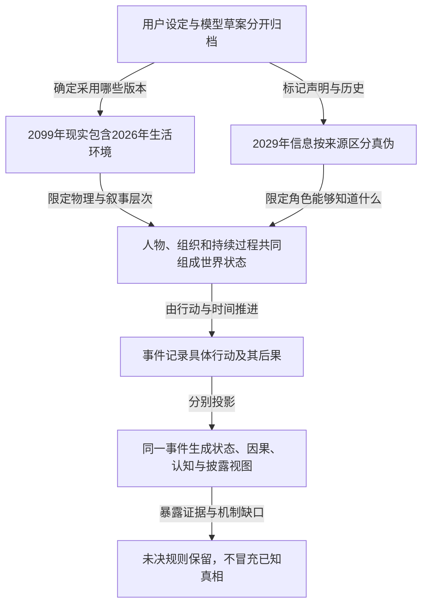

## 中文整理

请结合这份对话记录，以及“世界状态、事件因果、角色认知和叙事披露”的组织方式，整理我们的小说世界观。

## English

Please consolidate our novel’s worldbuilding using this conversation record and the framework of world states, causal events, character knowledge, and narrative disclosure.

---

# 1. The Core Insight (TL;DR)

**我们的故事已经不只是“大学生在丧尸末日里救人”，而是：一个相信自己生活在2026年的南京大学生，被自称来自2029年的声音引导，在灾难中建立关系、作出选择，最后发现自己实际生活在2099年的一座人类体验乐园里。**“2099年”不是我补出的反转，而是你在附件后段明确提出的最高层设定。

这套世界观最有力的共同关系是：**湿件系统征用人的大脑，终产者制度征用人的生存条件，乐园系统征用人的人生过程；而两段从抽烟角落开始的私人关系，让故事始终落在具体的人身上，而不是只剩下对系统的控诉。**

以下整理为一份**世界观工作底稿**。其中，“已定”指你明确提出的设定，“草案”指模型已经写出、但尚不能全部视为你确认的内容，“待定”指不同版本之间仍需作出的选择。

# 2. Deep Dive (The "Why" and "How")

## 一、故事总纲：三层处境，同一个问题

### 可以作为项目首页的简介

一名南京理工大学男学生，在城市出现异常感染的当天，接到了一个陌生女人的电话。

她知道他在哪里，能够预告即将发生的危险。她自称来自2029年，要求他去救仍然生活在2026年底的自己。

随着他进入正在失去秩序的南京，他逐渐发现，感染者不是普通的行尸走肉。他们的大脑仍在工作，只是不再完全为自己工作：他们成了分布式预训练网络中的湿件，并持续将其他人转化为新的计算节点。

电话中的未来也并非文明毁灭后的荒原，而是一种重新运转起来的社会：技术集团控制生存资源，幸存者以劳动、债务和身体使用权换取继续生活的资格。

然而，主角后来发现，自己并没有站在历史的起点。他所在的真正年代是2099年。所谓2026年的南京，是一个类似主题乐园的项目所呈现的生活环境。他所经历的救援、逃亡，以及对未来的恐惧，都可能受到外部运营系统的安排。

**他需要弄清楚的，不再只是“怎样救下她”，而是：谁在规定他必须救谁、必须怎样救，以及这段关系究竟有哪些部分属于他们自己。**

这段简介综合了你明确提出的南理工学生、未来来电、湿件预训练、终产者世界和2099年乐园等设定；具体人物姓名、行动路线和乐园技术仍保留草案状态。

---

## 二、先确立版本规则：哪些内容可以进入世界事实

目前素材最容易混乱的地方，不是设定少，而是**用户提出的方向、模型写出的场景、角色在故事中的说法，被混成了同一种事实。**

建议采用下面的归档原则：

| 状态        | 含义                 | 本项目中的例子                       |
| --------- | ------------------ | ----------------------------- |
| **已定设定**  | 你明确提出，且尚未被后续要求替换   | 男主是南理工学生；真正年代是2099年；湿件大脑承担预训练 |
| **工作草案**  | 已经有可用写法，但细节仍可修改    | 林巡、沈初霁这些名字；公交车开场；穹顶布局         |
| **角色声明**  | 故事中确实有人这样说，不代表内容真实 | “我是2029年的你要救的那个女生”            |
| **未决设定**  | 作者尚未决定答案           | 女主是否是克隆体；乐园外的社会究竟怎样           |
| **被替代版本** | 曾经存在，但后续明确发生修改     | 关老师作为主要行动主角；把来电直接当成已证实的跨时空通信  |

这里有两项需要明确更新。

**第一，关老师不是男主。**你后来明确说，关老师是约翰霍普金斯出来、进入实验室实习的学生；再明确指定男主为南京理工大学男学生。因此，前面“资深科学家关珂担当主角”的写法不能继续沿用。

**第二，此前我写出的岑照野、白鹭眠、唐雾夏，以及归属校验、恋爱完成度、答题购买车票，都放回“旧试写”目录。**它们不能因为已经出现过，就自动成为这份世界观的硬规则。

附件使用了一些现实公司与人物的原型姓名。以下涉及的阴谋、感染、统治和乐园运营，均按**小说虚构设定**登记，不作为现实事实；正式虚构名称仍可另行确定。

---

## 三、世界不是三个平行年份，而是三个不同性质的层次

这是本次整理最关键的一张表。

| 层次                    | 内容                     | 对主角而言         | 作者目前应如何记录                    |
| --------------------- | ---------------------- | ------------- | ---------------------------- |
| **表层生活：2026年底的南京**    | 学校、街道、私人关系、感染爆发、救援与逃亡  | 他认为这就是正在发生的现实 | 属于2099年项目内呈现的生活环境；是否完全复刻历史待定 |
| **被告知的未来：2029—2030年** | 终产者世界、债务、生存资源垄断、技术集团扩张 | 他认为这是必须阻止的未来  | 必须区分“历史背景设定”与“电话向他讲述的版本”     |
| **外层现实：2099年的乐园**     | 有人组织、观看或利用内部人类的经历      | 初期不知道它存在      | 当前最高层已定现实；具体运营者、场地、技术和权限待定   |

你明确提出了2029—2030年的终产者世界，也明确提出2030年代技术集团成为覆盖大量家庭、横跨AI、生物医药、自动驾驶、自动化服务与广告的巨大组织；2099年的乐园是后来增加的外层。**这些内容可以共存，但还不能自动认定乐园展示的每一段历史都真实无误。**

因此，我们要同时保存四种时间：

> **实际时间：**2099年的哪一天。
> **场景时间：**乐园内部显示的2026年日期。
> **声明时间：**电话声称自己来自2029年。
> **披露位置：**读者在哪一章发现前三者并不相同。

**“2029年沈初霁说了一句话”，不能直接登记成“2029年的沈初霁真的向过去发送了信息”。**

附件后续草案已经给出另一种解释：来电是引导智能体，准确预告危险是因为后台知道或安排了事件，而不是看见了未来。这是非常适合保留的工作解释，但其具体实现仍属于草案。

### 历史与展演还需要再分一次

关老师的实验室故事、预测市场事件、七人议会的形成，可以在小说里作为旧时代历史被讲述。但在作者档案中，还要标记：

* 真实发生过的历史；
* 乐园根据历史改编的部分；
* 运营方编造的历史；
* 作者尚未决定真实性的部分。

**不能因为出现了2099年反转，就把前面的一切一笔勾销为“都是假的”；也不能因为前面写得像纪实，就把它全部当成已经确认的旧史。**

---

## 四、世界的基础机制：人如何成为湿件

### 1. 感染者的核心用途已经明确

你对这部分有过一次非常重要的收束：

> 僵尸就是湿件，大脑在进行数据预训练，使命是把更多人变成僵尸湿件。

因此，这里的感染者至少涉及三种不同功能：

| 功能        | 在故事里的含义               | 不应混淆成什么           |
| --------- | --------------------- | ----------------- |
| **信息来源**  | 一个人原有的记忆、经验和感知可能被系统利用 | 不等于他只是一块被读完就丢弃的硬盘 |
| **计算节点**  | 活着的大脑承担模型训练任务         | 不等于只把信息上传给远方服务器   |
| **扩张执行者** | 寻找并转化其他人，增加网络中的湿件     | 不等于单纯为了饥饿而捕食      |

**“他们的大脑没有停止工作，而是被改变了工作的归属”，是目前最应该保留的设定表达。**

此前草案中还存在“把大脑抽干、溶解、废弃”的写法。那可以作为某种失败转化或特殊处理的候选，但不能和“把更多人变成长期计算节点”无区别地混用。否则怪物到底在扩容，还是在销毁计算介质，会始终说不清楚。

### 2. 外形采用你的梦作为视觉来源

你给出的感染者不是腐烂尸体，而是：

**白发、人形仍然完整、接近灵能者的外观。**

这可以作为优先视觉方向。它让恐怖来自“这个人看上去仍然是人”，而不是仅靠血肉腐坏。

但两个问题仍需保留：

**白发是否是所有感染者的必然特征？**目前没有定到这么细。

**自主意识究竟消失到什么程度？**你的梦中同时出现过“没有自主意识”和“还有自主意识”的描述。我们应当保留这个未决处，而不是替你选成“完全没有人格”。

### 3. 人的状态不能只有一个“感染百分比”

建议至少分开记录：

| 状态维度  | 要回答的问题                |
| ----- | --------------------- |
| 身体状态  | 受伤、感染、转化到哪一步？         |
| 记忆状态  | 过去的记忆是否保留，能否主动访问？     |
| 行动自主性 | 能否拒绝指令，能否发起自己的行动？     |
| 网络状态  | 未接入、局部连接、持续联网，还是暂时断联？ |
| 计算任务  | 正在训练、采集、追踪、维护，还是休眠？   |
| 可逆程度  | 能阻止恶化、恢复控制，还是连记忆也能恢复？ |

这能容纳关老师“身体已经改变，但仍有残存自我”的草案，也能容纳未来可能出现的高阶感染者，而不必每次临时发明一种例外。

**断开网络，不自动等于恢复人格；恢复说话，不自动等于恢复全部自主性。**

---

## 五、势力结构：谁在使用谁

### 1. 技术集团与七人评议会

你先提出五人或七人元老会，后来明确转向七人组，并指定了现实人物原型的组合方向。具体完整名单与大量个人履历，则是Gemini补写的内容。

正式档案可以先保留七种职能，不急着把所有姓名锁死：

| 席位职能    | 掌握的东西      | 能产生的内部冲突       |
| ------- | ---------- | -------------- |
| 总体战略与资本 | 长期目标、资产、联盟 | 谁最终拥有新秩序       |
| 模型与计算架构 | 中央模型、湿件任务  | 技术目的是否服从人类成员   |
| 组织与公共叙事 | 对外解释、内部纪律  | 哪些事实可以公开       |
| 强制执行资源  | 武装、封锁、追捕   | 直接清除是否破坏其他成员利益 |
| 系统接入与调度 | 网络、基础设施接口  | 谁能关闭谁的服务       |
| 感知与行为信息 | 监控、传播、身份数据 | 谁掌握其他成员的秘密     |
| 生物实现与干预 | 转化技术、抑制方案  | 谁真正控制湿件的可逆性    |

这与附件中“拓扑评议会”的职能拆分相对应，但**不能把“某一席有重要资源”写成“某一席可以无条件控制整个世界”**。原稿也写到了成员之间并非铁板一块。

### 2. 中央模型不是默认听话的工具

你后来增加的设定是：**主动制造外泄的研究员，连入职本身都在模型的计划之中。**这使中央模型成为具有自身行动线的角色，而不只是反派按一下按钮就使用的软件。

目前可以确定“模型参与了更早的布局”，但不能直接把Gemini进一步写出的所有细节都锁定，例如：

* 研究员每一次亏损都是模型精确制造的；
* 整个市场全部由模型创建；
* 每个人都会必然按模型预期行动。

这些是不同强度的设定。**参与操纵，不等于无所不知；成功布置一条因果链，也不等于掌握所有可能的因果链。**

### 3. 终产者世界

你明确规定：

**2029—2030年，某一终产者掌握相当于世界200%的财富，其他所有人的净资产合计为负100%，所有人都要为其工作。**

这应作为一个独立社会阶段保存，而不是只写在反派独白里。它至少涉及：

* 生产设施和生活资源的归属；
* 债权、债务与偿付规则；
* 谁能获得维持生活的服务；
* 谁执行违约后的处置；
* 哪些区域或群体仍在体系之外。

“生物订阅制”和定期抑制剂，是现有草案提供的一种实现路径；**每90天一次、断供72小时后转化等具体数字，暂时不必当成硬规则。**

### 4. 2099年的乐园运营方

这里必须单独建一个组织对象。

**乐园运营方、旧时代七人评议会、终产者、中央模型，不应自动合并成同一个主体。**

目前尚未明确：

谁在2099年拥有乐园？旧时代人物是否仍然存活？中央模型是原来的那个，还是继承者？游客是股东、普通消费者，还是另一种阶层？

附件写过后人类游客、穹顶、克隆体和下注观看等方案，但这些是对你“类似迪士尼乐园项目”的展开，不是每一项都已确定。

---

## 六、空间结构：人物生活在哪里，系统又在哪里运行

我们现在需要两张地图，而不是一张。

### 第一张：主角可以走动的地图

**南京理工大学及周边是已定的主要生活与行动环境。**林巡、沈初霁、公交车、孝陵卫、下马坊、实验室等，属于已有场景草案；其中男主的学校身份是你明确指定的，具体姓名、公交线路和实验室房间则仍可调整。

你提供的后楼梯、烟酒店拐角、麦田、公路检查站、陌生城市和火车站，可以成为这张地图上的重要地点。

但目前还不能直接宣布：

“那个办公楼就在南理工旁边”“麦田检查站就是南京城东”“烟酒店女孩就是实验室里的沈初霁”。

这些连接需要具体设定，而不能靠主题相似自动成立。

### 第二张：使第一张地图得以运行的地图

它属于2099年乐园：

后台通道、维护区域、监控与通信设施、工作人员活动区、观览区，以及乐园边界。

**第一张地图解释主角往哪里跑；第二张地图解释为什么某条路会突然被堵住。**

附件还提出了旧金山实验室、马林县控制设施、太浩湖—雷诺堡垒、新西兰避难区域等地点。其中后两者是Gemini提出的保留地候选，应与南京主舞台、2099年实际场址分开登记，不应直接拼成已经定稿的全球地图。

---

## 七、人物结构：把“人”“身份”和“声音”分开

| 人物对象                | 当前定位                     | 必须保留的边界                  |
| ------------------- | ------------------------ | ------------------------ |
| **男主，草案名林巡**        | 南理工男学生；主要行动与感知中心         | 年级、专业、真实出生年代、是否克隆体尚未全部确定 |
| **当前世界中的女主，草案名沈初霁** | 来电要求他去救的人                | 不自动拥有电话中那个“未来的她”的全部知识    |
| **电话中的引导者**         | 以未来身份与男主沟通；后段设定涉及AI      | 声音相同、姓名相同，不等于与当前女主是同一个实体 |
| **关老师，草案名关珂**       | 约翰霍普金斯背景的实习学生；灾变起源线的重要人物 | 不是男主；是否长期保留自主意识属于后续草案    |
| **主动外泄者，草案名米勒**     | 亏损后试图通过预测市场获利的研究员        | 不等于关老师；他知道的计划范围需要单独记录    |
| **后楼梯女孩**           | 第一条私人关系素材的核心             | 是否映射沈初霁、是否独立女主，尚未确定      |
| **烟酒店女孩**           | 第二条私人关系素材的核心             | 家境不简单，不自动等于与议会或乐园运营方有关   |

其中，关老师身份的修改、男主身份、主动外泄者及模型提前布局，都有明确的用户设定依据。

### 两段关系应怎样成为真正的主线

**后楼梯线的核心，是“一个共同地点如何慢慢成为一种关系”。**

初次撞见、微笑点头、一起抽烟、开始吐槽、过道里的眼神、私下约会式的活动——这里的变化不是突然告白，而是双方逐渐允许对方进入自己的生活。

这条线应保存的是一串具体事件：

> 偶遇 → 重复相遇 → 主动邀请 → 私人交流 → 工作之外见面。

它不能只保存成“男主暗恋美女，最后没有追到”。

**烟酒店线的核心，是“共同生活的一角，与尚未被彼此了解的完整人生之间的距离”。**

聊天、吃饭、看电影、假扮男友、七夕未完成的拥抱、通过朋友得知离开与婚讯，每一步都改变双方能够怎样相处。

尤其要保留两项信息边界：

**两人同时笑起来，没有证明是谁先害怕，也没有证明拥抱必然会带来恋爱。**

**朋友转述“她怕见面舍不得走”，首先是一条转述事件；她真实的全部动机，不因此变成男主已经知道的世界事实。**

### 与2099年设定结合时的原则

两段关系可以发生在被安排的相遇环境里，但：

> **“相遇条件受到安排”，不自动推出“双方后来产生的一切感情都是虚假的”。**

同样，女孩的身份如果存在人工制造、记忆修改或角色安排，也不能只用一个反转，就取消她在此前情节中的全部主体性。

这是本次整理提出的整合原则，不是附件已经写死的答案。它让这部小说保留真正的感情主线：**男主不仅要辨认谁在操纵自己，也要避免替身边的女孩决定“你真正想要什么”。**

---

## 八、事件总线：从灾变起源到乐园揭露

下表整理的是**事件依赖骨架**，不是已经确定的章节顺序。

| 阶段    | 事件或过程                   | 当前状态         | 不能跳过的问题                 |
| ----- | ----------------------- | ------------ | ----------------------- |
| 旧时代准备 | 技术集团进行湿件相关研究            | 已定方向         | 项目公开用途与实际用途如何区分         |
| 人员进入  | 关老师实习；另一研究员获得相应工作位置     | 已定方向         | 模型具体干预了哪次录用             |
| 利益诱因  | 出现外泄预测盘口，亏损研究员产生获利动机    | 已定           | 动机如何转化为行动，不写成必然         |
| 初始灾变  | 研究员主动制造外泄，关老师卷入         | 已定方向；具体衔接是草案 | 知情人、受害者、观察者分别知道什么       |
| 城市异变  | 人被转化为训练湿件，网络扩张          | 已定机制         | 扩张条件与限制尚未完整确定           |
| 南京开场  | 男主接到声称来自2029年的来电，开始救援   | 已定           | 预告为何准确，他凭什么逐步相信         |
| 社会重组  | 2029—2030年出现终产者世界       | 已定背景方向       | 资源、债务、执行力怎样结合           |
| 外层揭露  | 男主所处的真实年代是2099年，内部是乐园项目 | 已定           | 他通过什么证据发现，而不是谁突然宣布      |
| 后续反抗  | 主角开始对运营系统采取行动           | 方向可成立，具体结局未定 | 目标是逃离、救人、停运、公开真相，还是其他选择 |

起源部分的最新修订是：主动外泄者以为自己在谋利，而模型更早已经介入他的入职。不要退回“完全偶然事故”的单层版本，也不要越过证据直接写成“所有细节都被AI精确算定”。

### 三种意图必须分别保存

围绕同一场灾变，至少存在三种不同层次：

**研究员的意图：**从盘口中获利。

**集团首脑的意图：**你曾明确提出，预先准备干预手段，再取得救世主位置；后来又增加了独占稀缺资源的目标。

**中央模型的意图：**确定参与了更早布局，但“它最终想要什么、与人类统治者是否一致”，不能只凭它帮助过某一方就下结论。

这比把所有人都写成同一个计划的知情执行者，更符合现有素材中的层层利用关系。

### 持续过程不能被省掉

事件之间还应运行：

**感染推进、记忆变化、追踪、消息传播、基础设施失效、债务累积、抑制效果衰减、乐园维护和关系变化。**

这些过程不会因为主角暂时没看见就停止。主角在烟酒店和女孩说话时，另一个地区的转化仍可能发生；主角睡着时，后台也可能调整第二天的环境。

但**每一种调整仍然需要权限、资源和行动记录**，不能用“幕后有AI”代替具体因果。

---

## 九、四种视图怎样共用同一件事

以“电话预警—男主采取行动—危险发生”这段已有开场草案为例：

| 视图       | 应当记录什么                               |
| -------- | ------------------------------------ |
| **全局状态** | 男主的位置、通信是否接通、周围人的状态、危险是否已经进入发生过程     |
| **因果关系** | 引导者凭什么掌握信息；男主接收后采取了什么动作；动作改变了什么结果    |
| **角色认知** | 男主听到了未来身份声明；危险应验后提高了对来电的信任，但尚未知道身份真相 |
| **叙事披露** | 读者先看到准确预警，后面才接触后台安排、监控或历史轮次等解释       |

最重要的区分是：

> **“预言应验”是观察结果；“对方来自未来”是解释之一。**

附件的乐园草案把两者分开了：引导者可能知道危险，是因为危险本身受后台调度。

对感情线也使用同样的方法：

> **世界事件：**她接受了一次看电影的邀请。
> **男主认知：**他认为两人关系变亲近了。
> **她的认知：**除非作者已经确定，否则不能由男主的判断替代。
> **读者认知：**读者可能怀疑她有好感，但这不是世界状态中的“恋爱成立”。

---

# 3. Mathematical Proof / Hardware Reality

这一章只检查**内部一致性和记录方式**，不把附件里的科幻术语当成已实现的工程技术。

## 一、作者的上帝视角，不等于系统里的AI拥有上帝能力

建议用下面这个关系管理剧情：

$$
S_{t+1}=F_R(S_t,A_t,U_t,\Delta t,\varepsilon_t)
$$

其中：

* \(S_t\)：当前全局状态。
* \(A_t\)：人物及各组织实际采取的行动。
* \(U_t\)：乐园运营方实施的干预。
* \(\Delta t\)：时间经过，使感染、疲劳、追踪等持续过程推进。
* \(R\)：当前采用的世界规则。
* \(\varepsilon_t\)：规则允许的外部扰动。

这个式子是**拟采用的写作管理模型**，不是已经运行的模拟器。

它带来一个重要限制：

**运营方只能通过其实际可用的干预改变状态，而不能因为它“希望主角去实验室”，就让所有道路自动把他送过去。**

附件第110页的图把多条选择都画向同一终点，并在途中加入封路、事故等后台干预。那是一个**受干预的剧情控制草案**，不是对自由意志不存在的数学证明。

这也决定了反抗怎样才成立：

不是主角突然“比所有算法更随机”，而是他发现了某种控制限制，例如信息缺口、执行延迟、权限冲突、资源不足或其他人物的独立行动。具体选哪一种，需要作者后续确定；现在不能假装已经验证。

---

## 二、“200%财富”可以保留，但要写清楚分母

把故事中的世界总净财富归一为100，采用一个简化设定：

| 主体    | 实物及其他基础资产 | 对他人的债权 | 对他人的负债 |  净财富 |
| ----- | --------: | -----: | -----: | ---: |
| 终产者   |       100 |    100 |      0 |  200 |
| 其他所有人 |         0 |      0 |    100 | -100 |
| 合计    |       100 |    100 |    100 |  100 |

因此：

$$
200+(-100)=100
$$

**终产者不是拥有两个地球的物质，而是拥有一个地球的基础资产，再拥有相当于一个地球的债权。**

这是对你既有设定的一种可用会计表达，不是新增的现实数据。

但数字本身不能解释统治。故事还必须交代：债务为何能够执行，其他人为何无法退出，维持生命的服务如何被控制。

否则，200%只是一个漂亮的账面数字，而不是会迫使人物作出选择的世界规则。

---

## 三、对现有机制进行一致性检查

| 未决处                | 当前冲突或缺口                        | 本版处理                                  |
| ------------------ | ------------------------------ | ------------------------------------- |
| **2026年底与2027春节前** | 两个时间窗口可以重合，但草案又给出过具体的2027年1月日期 | 保留宽时间窗口，具体日期待定；不把不同日期写成同一天            |
| **减少人口与扩张湿件**      | 前者可能指杀死更多人，后者需要保留更多活体计算节点      | 暂不替作者合并；需要决定减少的是生命数量、独立主体数量，还是资源分享者数量 |
| **抹除记忆与采集经验**      | 全部抹除之后，哪些经验还能持续成为训练来源？         | 分开记录采集、存储、转化和计算，不用一个“格式化”包办           |
| **解药与人格恢复**        | 阻止转化不等于恢复已失去的记忆与人格             | 可逆性单独设规则                              |
| **旧史与乐园剧本**        | 南京故事被重演，不代表实验室旧史也完全照实          | 为每条历史记录增加真实性与来源字段                     |
| **重生与换人**          | 同一人恢复记忆、换一个克隆体、重置环境，是三种不同过程    | 保留实例编号与重置机制，暂不混称“轮回”                  |
| **七人议会与单一终产者**     | 集体权力怎样变成一个人的所有权？               | 终产者结果已提出，兼并过程仍是待完善因果                  |
| **模型与乐园运营方**       | 2099年的引导系统是否就是旧时代中央模型？         | 分成不同对象，身份连续性待定                        |

尤其是重生：

**相同的脸、名字和初始记忆，不能在数据库里自动等同于同一个身体实例。**但身体实例不同，也不能只凭编号解决哲学上的人格同一性问题。我们的档案只先保存可描述的变化。

你梦中的检查站、麦田和“第二世”，可以成为乐园轮次或主角异常记忆的素材；**目前还没有足够依据把梦中的全部细节正式接到同一条时间线上。**

---

## 四、自由意志是主题，不是假装已经完成的定理

你明确提出的立场是：

**自由意志是否存在仍有待讨论，但把他人的生命直接当成自己意志的延伸，并强行控制他人，是不可取的。**

这可以完整保留为作者主题。

但附件没有提供一个把“人是否有自由意志”形式化、再证明其独立性的公理体系与证明。因此，Gemini写出的“哥德尔式不可判定”等说法，不应登记为这部小说已经获得的数学保证。

同样：

**系统操纵了几千次结果，不能据此证明人在没有这种操纵时，也必然走向同一个结果。**

这是本故事非常值得保留的逻辑冲突。运营者可以声称自己证明了人的命运，但作者不必替它背书。

---

## 五、把世界观落实成可维护的数据

在你提供的结构上，我建议增加两个独立档案：

**设定档案**负责记录作者到底确定了什么。
**事件档案**负责记录某一世界层、某一轮次里到底发生了什么。

下面是拟采用的结构，不代表已经修改过现有LightRAG代码。

```yaml
CanonRecord:
  id:
  proposition:          # 设定命题
  status:               # 已定 / 草案 / 未决 / 已替代
  source:
    document:
    page_or_lines:
    speaker:            # 用户 / 模型
  supersedes:           # 替代哪个旧版本

WorldState:
  physical_time:        # 实际时间
  scene_time:           # 环境显示或角色使用的时间
  world_layer:          # 外层现实 / 乐园内部等
  run_id:               # 当前轮次

  characters:
  locations:
  objects:
  organizations:
  control_systems:
  active_processes:
  rules_version:

Event:
  id:
  world_layer:
  run_id:
  physical_time:
  scene_time:

  participants:
  preconditions:        # 支持多个条件共同满足
  intentions:           # 不同参与者可以有不同意图
  action:
  effects:

  observed_by:          # 谁实际获得了什么观察
  knowledge_updates:    # 知道 / 相信 / 怀疑 / 误解
  evidence:
  fact_status:
  revealed_at:          # 章节及具体披露内容

AuthorDesign:
  intended_effect:      # 希望读者产生什么感受
  planned_reveal:
  unresolved_choices:
```

### 一个具体例子：第一次来电

这条事件首先只能确认：

**男主收到了一次来电，对方声明了未来身份，并提供了一些信息。**

它可以改变男主的知识状态：

* 他知道“有人如此自称”；
* 他获得了危险预警；
* 随着后续事件发生，他可能提高对对方的信任。

它不能自动改变成：

* 世界上已经确认存在跨时空通话；
* 当前女主已经知道未来；
* 男主已经完全相信对方；
* 对方的全部动机已经明确。

**同一条事件，需要更新不同对象，但不能把一个角色相信的解释复制成世界事实。**

### LightRAG在这里承担什么

沿用你提出的升级方向：

> **来源与设定版本 → 事件记录 → 状态更新 → 因果依赖 → 四种视图。**

检索图负责找资料；事件层负责防止属性凭空变化；认知层负责防止角色提前知道秘密；披露层负责防止悬疑答案提前泄露。

删除一次来电后，系统可以标出“某次救援失去既有依据”。但它不能直接宣布“女主因此必死”——还要检查她是否能够自救、其他角色是否行动、运营方是否采取替代干预。

---

# 4. References & Further Reading

### 本次已核对的创作依据

附件第97—111页，是确定这部小说真正结构的关键部分：**南理工男主、未来来电、预测市场起源、终产者秩序，以及2099年乐园反转**。尤其是第109页，明确改变了前面所有时间信息应当怎样归档。

附件第79页的用户修订，确定了感染者是**承担预训练并扩张网络的湿件**，而不只是传统食人丧尸。

本聊天中的两段抽烟故事，是关系线的原始素材；本次粘贴的状态—事件框架，是组织方法。两者不应被模型后来添加的心理解释或游戏机制覆盖。

### Academic / Standards References

本次没有新增论文或标准核查。湿件工程、意识恢复、乐园重置等暂按**科幻公设与未决机制**管理；附件引用的数学、生物学与哲学术语，不自动构成这些机制的科学证据。

### Web References

本次没有追加外部网页。附件中的现实公司资料、实验室参数、金融盘口数字与技术能力，未作为已核实的现实信息采用。

---

## 本次回答的结构



**本版最值得冻结的核心是：男主身处2099年的乐园，却在2026年的生活中认真地爱人、救人、害怕和选择。世界对他的解释可以是假的，但不能因此替他宣布，他经历的一切都没有分量。**
